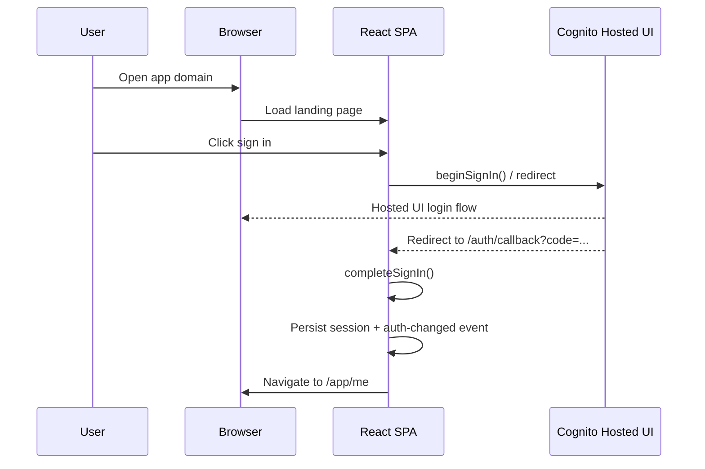
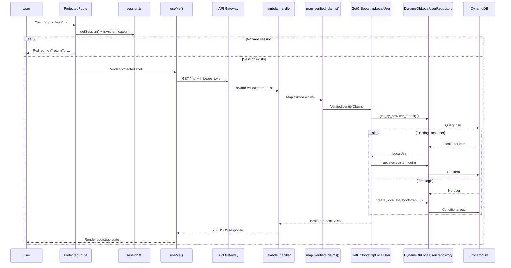
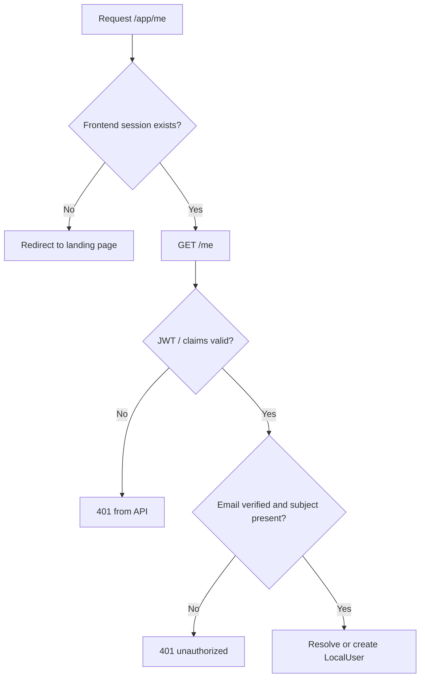
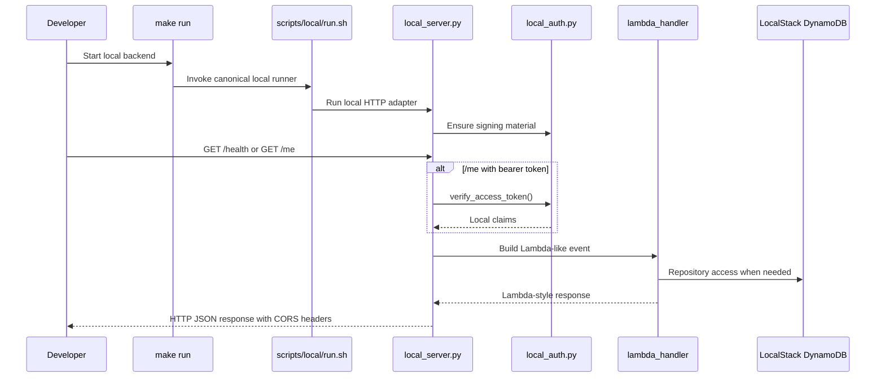
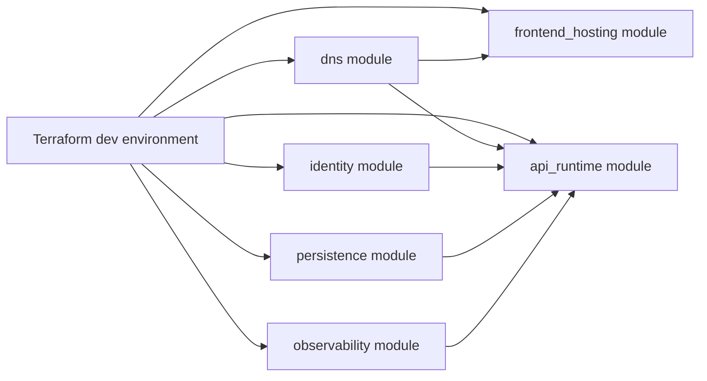

# Auth Bootstrap Runtime Flows

Generated: 2026-04-23  
Scope: current auth-bootstrap request and LocalStack-backed local-development execution paths

## 1. Purpose

This companion artifact captures the most important runtime sequences behind the current Campfire foundation:

- sign-in and callback completion
- protected-route access
- `/me` bootstrap resolution
- local backend execution

Use this document when debugging auth/bootstrap behavior or when adding new authenticated surfaces.

## 2. Production Sign-In and Callback Flow

### Observations

- Credential handling is delegated fully to Cognito Hosted UI.
- The frontend owns only redirect initiation and callback completion.
- Development mode bypasses this flow with a synthetic session for faster local UI work.

## 3. Protected Route and Bootstrap Flow

### Observations

- Trust establishment happens before the application use case executes.
- The use case works with normalized claims, not raw API Gateway event payloads.
- `/me` is both the first-login bootstrap path and the returning-session refresh path.

## 4. Unauthorized and Invalid Identity Paths

### Notes

- Missing frontend session never reaches protected content.
- Backend rejects both missing JWT context and mapped-claim validation failures.
- Verified email is a business gate for initial Campfire access.

## 5. Local Backend Flow

### Why This Matters

- Local execution reuses the real handler instead of a separate dev-only app.
- Auth verification still happens before the handler sees claims.
- This keeps local debugging close to the production trust boundary.

## 6. Infrastructure Provisioning Flow

### Notes

- `environments/dev/main.tf` is the orchestration root.
- `api_runtime` depends on DNS, identity, persistence, and observability outputs.
- Web and API domains are separate subdomains under one root domain.

## 7. Debugging Checklist By Runtime Step

### Landing or redirect problems

- Verify CloudFront and Route53 alias records.
- Verify frontend env values for auth authority and redirect URI.
- Verify Cognito callback and logout URLs match deployed domains.

### Callback problems

- Check whether `completeSignIn()` resolves or rejects.
- Confirm the returned URL includes a valid authorization code.
- Confirm browser storage receives the session payload.

### Protected route problems

- Confirm `getSession()` returns a non-expired session.
- Confirm `ProtectedRoute` is mounted under the expected path.
- Confirm the route is not redirecting due to a stale dev session.

### `/me` problems

- Check API Gateway JWT authorizer configuration.
- Check backend logs for `me_unauthorized`, `me_rejected`, or `me_success`.
- Check DynamoDB lookup/create behavior for the provider identity.

### Local backend problems

- Confirm LocalStack is running on `http://localhost:4566`.
- Confirm local JWT signing material exists.
- Confirm the generated token issuer/audience match the local verifier settings.
- Confirm the local server is building the event with `authorizer.jwt.claims`.
