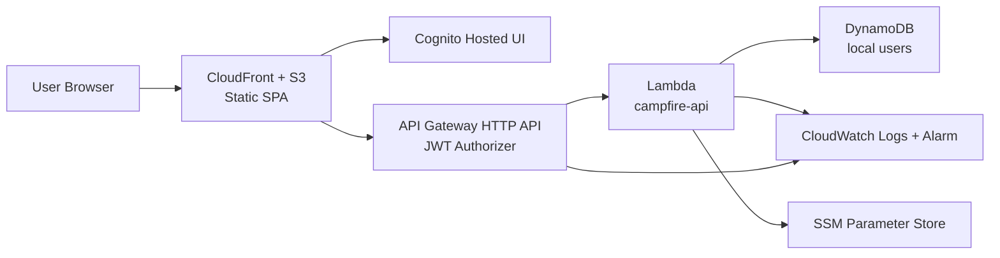
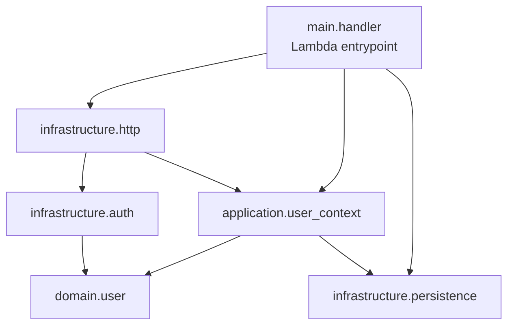
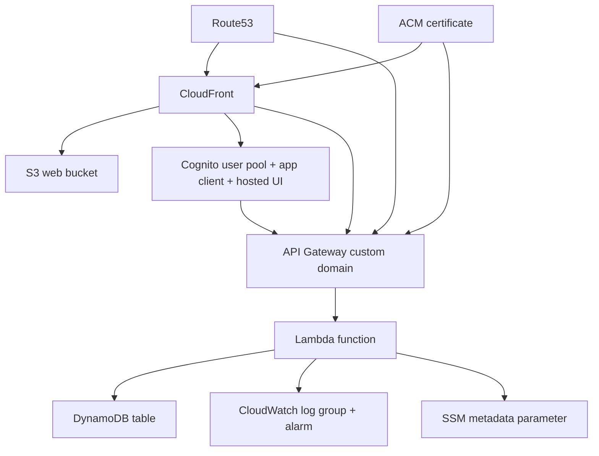

# Campfire Project Architecture Blueprint

Generated: 2026-04-23  
Scope: current repository state for the delivered `001-auth-bootstrap` slice and active `002-cicd-local-env` platform work

## 1. Executive Summary

Campfire currently implements a small modular monolith inside a monorepo:

- `apps/web` is a React + Vite single-page application hosted as static assets.
- `apps/api` is a Python 3.12 Lambda-style backend with a thin HTTP adapter and a small application core.
- `infra/terraform` provisions the AWS runtime using reusable modules and one `dev` environment composition.
- `apps/shared/contracts` mirrors the public API contract so frontend, backend, and spec artifacts stay aligned.

The dominant architectural shape is a hybrid:

- Monorepo at the repository level
- Modular monolith at the product level
- Clean/Hexagonal architecture in the backend
- Route-driven SPA architecture in the frontend
- Environment/module composition in Terraform

This is a good fit for the current stage because it keeps deployment boundaries clear without creating service sprawl.

## 2. Technology Inventory

| Area | Current stack | Evidence |
| --- | --- | --- |
| Frontend | React 18, TypeScript, Vite, React Router, TanStack Query, `oidc-client-ts` | `apps/web/package.json` |
| Backend | Python 3.12, `boto3`, `pydantic`, AWS Lambda Powertools | `apps/api/pyproject.toml` |
| Infrastructure | Terraform 1.8+, AWS Route53, ACM, CloudFront, S3, Cognito, API Gateway HTTP API, Lambda, DynamoDB, CloudWatch, SSM Parameter Store | `infra/terraform/` |
| Contracts | OpenAPI 3.1 | `apps/shared/contracts/auth-bootstrap-api.openapi.yaml` |
| Frontend testing | Vitest, Testing Library, Playwright | `apps/web/package.json`, `apps/web/tests/` |
| Backend testing | pytest, LocalStack-backed integration tests, Moto fallback, contract/e2e tests | `apps/api/pyproject.toml`, `apps/api/tests/` |
| Local backend runtime | HTTP adapter over real Lambda handler, LocalStack, locally signed JWTs | `apps/api/src/main/local_server.py`, `scripts/local/*.sh`, `Makefile` |

## 3. Architectural Overview

### 3.1 System Shape



### 3.2 Architectural Principles Visible in the Codebase

- Identity is treated as a platform concern, not domain logic.
- The backend owns Campfire-specific bootstrap logic after trust is established at the boundary.
- Frontend responsibilities stop at navigation, session persistence, and calling the authenticated API.
- Terraform owns long-lived cloud resources and their integration.
- Shared contracts sit outside app implementations so API shape is not defined in only one place.

### 3.3 Primary Boundaries

- Frontend boundary: route handling, OIDC redirect handling, session storage, `/me` fetching, and UI states.
- Backend boundary: translate trusted claims into a local Campfire user context.
- Infrastructure boundary: host frontend, validate JWTs, configure domains, persist user records, and emit baseline observability.
- Spec/documentation boundary: delivered auth behavior is described in `specs/001-auth-bootstrap/`; active platform behavior is described in `specs/002-cicd-local-env/` and reinforced by ADRs and contract files.

## 4. Repository and Subsystem Map

```text
apps/
  api/
    src/
      domain/
      application/
      infrastructure/
      main/
    tests/
  web/
    src/
      app/
      features/
      routes/
      lib/
    tests/
  shared/
    contracts/

infra/
  terraform/
    environments/dev/
    modules/

docs/
  adr/
  architecture/
```

### 4.1 Why This Layout Works

- `apps/api` keeps the backend small enough to understand by layer.
- `apps/web` organizes by app shell, routes, and features rather than by generic component buckets alone.
- `apps/shared/contracts` gives the repo a neutral place for public API definitions.
- `infra/terraform/modules` isolates reusable AWS concerns while `environments/dev` remains the orchestration root.

## 5. Backend Architecture

### 5.1 Layer Map



### 5.2 Layer Responsibilities

| Layer | Purpose | Current contents |
| --- | --- | --- |
| `domain` | Campfire-owned business concepts and invariants | `LocalUser`, `VerifiedIdentityClaims`, repository port |
| `application` | Use cases and DTOs | `GetOrBootstrapLocalUser`, `BootstrapIdentityDto` |
| `infrastructure` | Adapters for HTTP serialization, claim mapping, and DynamoDB persistence | `me.py`, `claims.py`, `local_user_repository.py` |
| `main` | Composition root, settings, logging, observability, Lambda/local-server entrypoints | `handler.py`, `settings.py`, `local_server.py` |

### 5.3 Dependency Rules

- `domain` should not depend on `application`, `infrastructure`, or `main`.
- `application` may depend on `domain` abstractions and types.
- `infrastructure` may depend on `application` and `domain` to implement ports and translate boundary payloads.
- `main` composes everything and is allowed to depend on any backend package.

No circular dependency is visible in the current slice.

### 5.4 Key Backend Components

#### Domain Model

`VerifiedIdentityClaims`

- A normalized, trusted input model after API Gateway JWT validation.
- Carries provider name, subject, email, email verification, and display name.
- Prevents infrastructure claim shape from leaking directly into application logic.

`LocalUser`

- Campfire-owned user aggregate for the auth-bootstrap slice.
- Encapsulates bootstrap creation and returning-login refresh through `bootstrap()` and `register_login()`.
- Uses immutable dataclass semantics, which keeps state transitions explicit.

#### Application Service

`GetOrBootstrapLocalUser.execute()`

- Rejects missing provider subjects.
- Rejects identities without verified email.
- Loads an existing user by provider identity.
- Updates login metadata for returning users.
- Creates a new `LocalUser` on first login.
- Returns a DTO already shaped for the external contract.

This is the primary business use case in the current system.

#### Ports and Adapters

`LocalUserRepository`

- Repository port for user lookup, creation, and update.
- Lets the application stay independent from DynamoDB details.

`DynamoDbLocalUserRepository`

- Queries by provider identity through `gsi1`.
- Uses conditional create to reduce duplicate creation risk.
- Falls back to loading the existing user if a race hits the conditional write path.

This is a clean hexagonal implementation: the application consumes a port, and infrastructure supplies the adapter.

### 5.5 Request Flow

`main.handler.lambda_handler()` acts as a hand-written router:

- `GET /health` returns a simple liveness payload.
- `GET /me` extracts claims from the API Gateway event and delegates to `me_response()`.
- Missing or invalid claims return `401`.
- Unknown routes return `404`.

This is intentionally lightweight. The tradeoff is that endpoint growth will eventually justify a more explicit routing abstraction, but the current approach is appropriate for a two-endpoint service.

## 6. Frontend Architecture

### 6.1 Frontend Structure

| Area | Purpose |
| --- | --- |
| `src/app` | app composition, router, top-level providers, global styles |
| `src/features/auth` | OIDC session handling, sign-in/out actions, auth config |
| `src/features/me` | authenticated `/me` data fetching |
| `src/routes/public` | public landing and auth callback routes |
| `src/routes/protected` | route guard, shell, and authenticated bootstrap screen |
| `src/lib` | environment/config helpers, API client, shared frontend types |

### 6.2 Frontend Runtime Model

```mermaid
flowchart LR
    L[Landing Page] --> S[beginSignIn]
    S --> C[Cognito Hosted UI]
    C --> CB[AuthCallbackPage]
    CB --> SES[session.ts]
    SES --> PR[ProtectedRoute]
    PR --> APP[AppShell]
    APP --> ME[useMe]
    ME --> API[/me API]
```

### 6.3 Key Frontend Patterns

#### Route Composition

`router.tsx` defines three top-level route zones:

- `/` for public entry
- `/auth/callback` for OIDC return
- `/app` for protected application pages

Protected children are nested under `AppShell`, which keeps future authenticated features inside one shell boundary.

#### Session Management

`features/auth/session.ts` is the session boundary:

- Creates the OIDC user manager.
- Starts sign-in redirects.
- Completes callback handling.
- Persists session state to browser storage.
- Publishes `campfire-auth-changed` for route/UI refresh.

The current design is simple and avoids introducing a global state library prematurely.

#### Route Protection

`ProtectedRoute.tsx` reads local session state and redirects unauthenticated visitors back to `/`, preserving a `returnTo` intent.

This makes the protected boundary explicit at the router layer rather than scattering checks throughout screens.

#### Data Fetching

`useMe()` uses TanStack Query with a single `["me"]` query key and a thin `apiRequest()` wrapper that injects the bearer token.

This sets a good baseline for future server-state features because:

- request concerns stay in `lib/http.ts`
- screen components stay focused on UI states
- auth token propagation remains centralized

### 6.4 Current Frontend Architectural Tradeoffs

- Development mode short-circuits sign-in with a mock session in `session.ts`.
- This keeps local UI iteration fast, but it means production auth behavior is not fully exercised in the pure frontend dev loop.
- The authenticated shell already anticipates future product surfaces, but those links still point to `/app/me`.

## 7. Data Architecture

### 7.1 Core Data Objects

| Object | Role | Source of truth |
| --- | --- | --- |
| `VerifiedIdentityClaims` | trusted identity input | API Gateway JWT claims mapped by backend code |
| `LocalUser` | Campfire-owned user record | DynamoDB item serialized by repository adapter |
| `BootstrapIdentityDto` | boundary DTO for `/me` | application layer |
| `BootstrapIdentityResponse` | frontend/shared contract type | OpenAPI + frontend TS types |

### 7.2 Persistence Pattern

Current persistence uses a single DynamoDB table:

- table key: `pk` + `sk`
- lookup index: `gsi1pk` + `gsi1sk`
- access pattern: find user by provider identity
- recovery posture: point-in-time recovery enabled
- encryption posture: server-side encryption enabled

This is a single-table style shape, even though the current slice stores only one aggregate type.

### 7.3 Mapping Pattern

Data transformation is explicit at each layer:

- raw JWT claims -> `VerifiedIdentityClaims`
- `LocalUser` + `first_login` -> `BootstrapIdentityDto`
- DTO -> JSON contract payload
- JSON payload -> frontend `BootstrapIdentityResponse`

That separation is a strong architectural choice because it limits schema leakage across boundaries.

## 8. Cross-Cutting Concerns

### 8.1 Authentication and Authorization

Production path:

- Cognito Hosted UI handles credential entry.
- The SPA uses authorization code + PKCE.
- API Gateway JWT authorizer validates audience and issuer before Lambda execution.
- Backend code only consumes mapped claims after boundary validation.

Local path:

- `local_server.py` verifies locally signed JWTs before building a Lambda-like event.
- The same Lambda handler processes the local request path.

This is consistent with the project rule that identity is an infrastructure capability first.

### 8.2 Error Handling

Backend:

- invalid or missing auth context returns `401`
- invalid claim mapping or unverified email becomes `PermissionError` at the HTTP adapter boundary
- unknown routes return `404`

Frontend:

- `apiRequest()` throws `HttpError`
- `MeBootstrapPage` renders loading, error, and success states explicitly
- `AuthCallbackPage` returns to `/` if callback completion fails

### 8.3 Logging and Monitoring

Current observability is intentionally small but real:

- `configure_logging()` initializes the shared backend logger
- `Observability.record_event()` writes structured event-style log lines and in-memory counters
- API Gateway stage access logs are enabled
- CloudWatch log group retention is defined
- a Lambda error alarm is provisioned in Terraform

This is a good baseline, though it is not yet a full tracing or metrics architecture.

### 8.4 Validation

Validation is distributed intentionally:

- API Gateway validates JWT issuer/audience
- `map_verified_claims()` validates required claim presence and normalizes types
- `GetOrBootstrapLocalUser.execute()` validates verified email and required subject
- frontend request failures are surfaced as route-level UI state, not silently ignored

### 8.5 Configuration Management

Frontend:

- `src/lib/env.ts` reads `VITE_*` values with local defaults

Backend:

- `load_settings()` reads runtime environment variables for URLs, region, user pool, and table names

Infrastructure:

- Terraform injects Lambda environment values
- Cognito metadata is written to SSM Parameter Store

Secrets/config are therefore not hardcoded into the deployed application binaries, although local defaults exist for developer ergonomics.

## 9. Service Communication Patterns

### 9.1 Current Communication Modes

| Interaction | Mode | Notes |
| --- | --- | --- |
| Browser -> static frontend | HTTPS | CloudFront serves SPA assets |
| Browser -> Cognito Hosted UI | Redirect-based OIDC | authorization code + PKCE |
| Browser -> API Gateway | HTTPS JSON API | bearer token from local session storage |
| API Gateway -> Lambda | AWS proxy integration | payload format `2.0` |
| Lambda -> DynamoDB | synchronous SDK access | repository adapter via `boto3` |
| Lambda -> CloudWatch logs | structured log lines | app + API Gateway access logs |

There is no asynchronous messaging or event bus in the current slice.

### 9.2 API Surface

Current API contract is deliberately narrow:

- `GET /health`
- `GET /me`

This keeps the backend focused on a single trust-establishment workflow.

## 10. Infrastructure and Deployment Architecture

### 10.1 Environment Composition

`infra/terraform/environments/dev/main.tf` composes the deployment from reusable modules:

- `dns`
- `frontend_hosting`
- `identity`
- `persistence`
- `observability`
- `api_runtime`

This is a strong pattern for future environment expansion because the environment file stays orchestration-focused.

### 10.2 Deployment Topology



### 10.3 Infrastructure Module Roles

| Module | Responsibility |
| --- | --- |
| `dns` | hosted zone lookup, ACM certificate, DNS validation |
| `frontend_hosting` | private S3 bucket, CloudFront distribution, OAC, SPA fallback behavior |
| `identity` | Cognito user pool, user pool client, hosted UI domain, SSM metadata |
| `persistence` | DynamoDB table and GSI for local users |
| `observability` | CloudWatch log group and Lambda error alarm |
| `api_runtime` | Lambda, IAM, API Gateway, JWT authorizer, CORS, custom domain |

### 10.4 Security Defaults in Terraform

- S3 public access is blocked.
- CloudFront uses origin access control to reach S3 privately.
- Viewer protocol is redirected to HTTPS.
- TLS minimum protocol is enforced on CloudFront and API domain resources.
- Cognito is admin-create-only for users.
- Lambda IAM is scoped to DynamoDB, logs, and SSM parameter access.
- DynamoDB encryption and PITR are enabled.

This aligns well with the repo’s stated security-first baseline.

## 11. Testing Architecture

### 11.1 Backend Testing

Current backend tests are separated by test type:

- `tests/contract` verifies handler responses against the public API contract shape
- `tests/integration` covers DynamoDB repository behavior and auth failures
- `tests/e2e` exercises the local HTTP server and end-to-end request path

This is a practical architecture-aligned test strategy because it validates:

- the application boundary
- the persistence adapter
- the locally emulated runtime path

### 11.2 Frontend Testing

Current frontend tests include:

- unit tests for auth routing behavior
- Playwright e2e tests for public entry, session failures, and `/me` bootstrap

This provides useful coverage at the UX boundary, though the frontend still has room for more feature-level unit tests as the app grows.

## 12. Local Development Architecture

Local backend execution is intentionally high-fidelity:

- LocalStack supplies DynamoDB and the other AWS-shaped local services
- `local_server.py` translates HTTP requests into Lambda event shapes
- local JWT signing and verification simulate trusted auth input
- the root Makefile calls `scripts/local/*` for startup, token generation, smoke validation, and teardown

This keeps developer and CI integration flows on the same AWS-shaped local plane while still reusing the production handler and auth shape.

## 13. Representative Implementation Patterns

### 13.1 Port + Adapter Pattern

```python
class LocalUserRepository:
    def get_by_provider_identity(self, provider_name: str, provider_subject: str) -> LocalUser | None: ...
    def create(self, user: LocalUser) -> LocalUser: ...
    def update(self, user: LocalUser) -> LocalUser: ...
```

```python
class DynamoDbLocalUserRepository(LocalUserRepository):
    def get_by_provider_identity(self, provider_name: str, provider_subject: str) -> LocalUser | None:
        ...
```

Use this pattern again when a new infrastructure dependency is introduced.

### 13.2 Use Case Boundary Pattern

```python
result = use_case.execute(claims)
return result.to_response()
```

The HTTP layer stays thin while business behavior remains in the application layer.

### 13.3 Route Guard Pattern

```tsx
if (!authenticated || !getSession()) {
  return <Navigate to={`/?returnTo=${encodeURIComponent(requireAuthenticatedPath(location.pathname))}`} replace />;
}
```

Keep access control at route boundaries where possible.

### 13.4 Thin Fetch Wrapper Pattern

```ts
return apiRequest<BootstrapIdentityResponse>("/me", {
  accessToken: session?.accessToken ?? null,
});
```

As the API grows, expand this through dedicated feature hooks before adding a generalized client abstraction.

## 14. Architectural Decision Snapshot

The repository already captures the foundational decision in `docs/adr/ADR-0001-auth-bootstrap-foundation.md`. The current implementation reinforces these decisions:

- Static SPA instead of SSR or full-stack server rendering
- Managed Cognito Hosted UI instead of custom credential handling
- API Gateway JWT validation before backend use-case execution
- Lambda + DynamoDB for the first authenticated slice
- Shared `GET /me` contract as the stable post-login seam

### 14.1 Consequences

Positive:

- low operational burden
- clear trust boundary
- strong fit for solo-maintainer ownership
- easy to reason about component boundaries

Negative or limiting:

- hand-written Lambda router may become awkward as endpoints grow
- localStorage-based session persistence will need review when auth complexity increases
- architectural governance is mostly convention- and test-driven today

## 15. Architecture Governance

Current governance mechanisms:

- `AGENTS.md` defines project-wide architectural preferences
- active Spec-Kit files define intended behavior and structure for the current slice
- ADR captures the foundation choice
- shared OpenAPI contract aligns frontend/backend expectations
- backend and frontend tests enforce important boundary behavior

Current gaps:

- no automated dependency rules for backend layer enforcement
- no architecture linter for Terraform/module coupling
- no generated dependency diagram pipeline

For now, consistency is maintained mostly through repository structure, review discipline, and explicit docs.

## 16. Blueprint for New Development

### 16.1 Adding a New Backend Feature

Use this sequence:

1. Add or update the spec and public contract first.
2. Model new core concepts in `domain/<context>/`.
3. Add the use case and DTOs in `application/<context>/`.
4. Add adapters in `infrastructure/` for HTTP, persistence, or external services.
5. Wire dependencies only in `main/`.
6. Add contract, integration, and e2e coverage for the new boundary.

Placement rules:

- business invariants belong in `domain`
- orchestration belongs in `application`
- AWS/HTTP/database specifics belong in `infrastructure`
- env loading and object graph construction belong in `main`

### 16.2 Adding a New Frontend Feature

Use this sequence:

1. Extend the shared contract and frontend types.
2. Add feature-local data hooks under `src/features/<feature>/`.
3. Add route screens under `src/routes/` when navigation changes are involved.
4. Keep shell-level composition in `src/app` and `src/routes/protected/AppShell.tsx`.
5. Reuse `lib/http.ts` and auth session helpers instead of embedding fetch/auth logic inside screens.

Placement rules:

- route guards stay centralized
- server data access belongs in hooks, not in large page components
- auth/session logic stays in `features/auth`
- generic environment and transport utilities stay in `lib`

### 16.3 Adding a New Terraform Capability

Use this sequence:

1. Create or extend a focused module in `infra/terraform/modules/`.
2. Wire it from `infra/terraform/environments/dev/main.tf`.
3. Export only the outputs required by other modules or deployment tooling.
4. Keep IAM scoped to the smallest practical surface.
5. Update quickstart or operator docs if local/dev workflows change.

### 16.4 Common Pitfalls To Avoid

- putting business rules directly into Lambda handlers
- letting raw JWT claim shapes leak past the auth mapping boundary
- coupling frontend screens directly to environment variables or `fetch`
- adding AWS resource wiring directly in environment files when it belongs in a reusable module
- expanding the authenticated shell with placeholder routes that bypass real feature boundaries for too long

## 17. Recommended Next Architectural Improvements

- Introduce explicit backend unit tests for domain/application behavior as the use-case layer expands.
- Add a small dependency-conformance check for backend layer imports.
- Decide whether frontend session state should remain event/localStorage based or move to a dedicated app-state boundary as auth behavior grows.
- Add module-level README files inside `infra/terraform/modules/` once more AWS capabilities are introduced.
- Consider generating contract types from OpenAPI when endpoint count increases.

## 18. Update Guidance

This blueprint should be updated when any of the following happen:

- a new backend bounded context is introduced
- a new external integration or AWS service is added
- the frontend app shell gains new authenticated feature zones
- the deployment topology changes beyond the current `dev` environment baseline
- the backend routing style changes from the current hand-written Lambda dispatcher

When updating this file, favor evidence from:

- source code in `apps/`
- Terraform in `infra/terraform/`
- active specs and ADRs in `specs/` and `docs/adr/`
