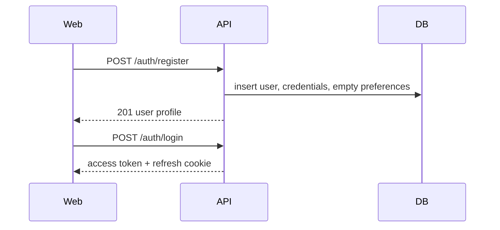
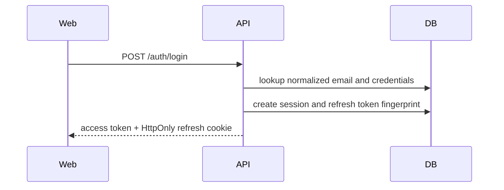
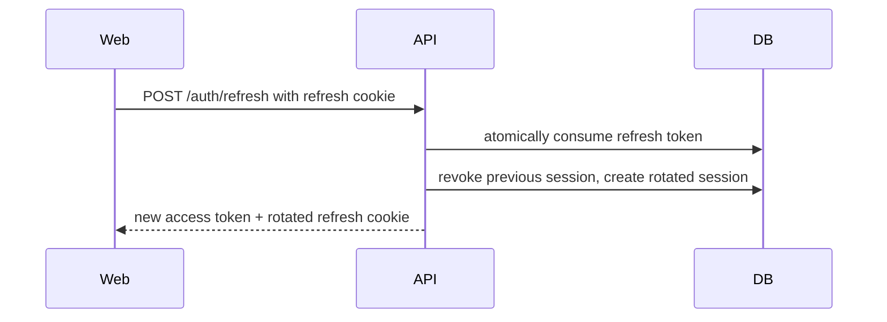
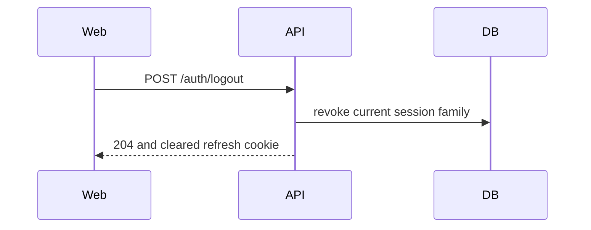

## Register

```mermaid
sequenceDiagram
  participant Web
  participant API
  participant DB
  Web->>API: POST /auth/register
  API->>DB: insert user, credentials, empty preferences
  API-->>Web: 201 user profile
  Web->>API: POST /auth/login
  API-->>Web: access token + refresh cookie
```

## Login

```mermaid
sequenceDiagram
  participant Web
  participant API
  participant DB
  Web->>API: POST /auth/login
  API->>DB: lookup normalized email and credentials
  API->>DB: create session and refresh token fingerprint
  API-->>Web: access token + HttpOnly refresh cookie
```

## Refresh

```mermaid
sequenceDiagram
  participant Web
  participant API
  participant DB
  Web->>API: POST /auth/refresh with refresh cookie
  API->>DB: atomically consume refresh token
  API->>DB: revoke previous session, create rotated session
  API-->>Web: new access token + rotated refresh cookie
```

## Logout

```mermaid
sequenceDiagram
  participant Web
  participant API
  participant DB
  Web->>API: POST /auth/logout
  API->>DB: revoke current session family
  API-->>Web: 204 and cleared refresh cookie
```
