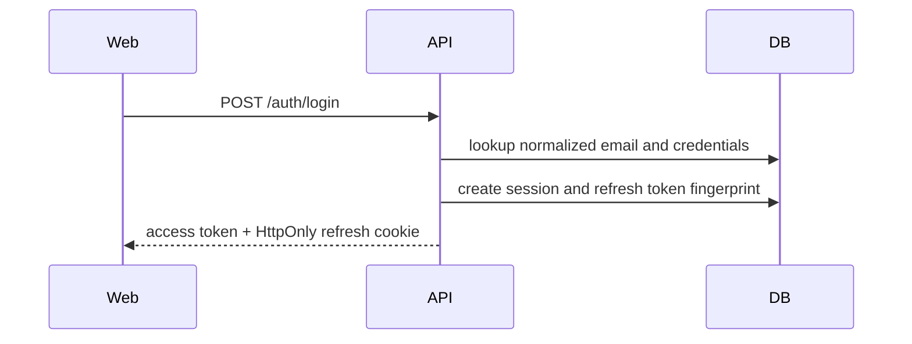
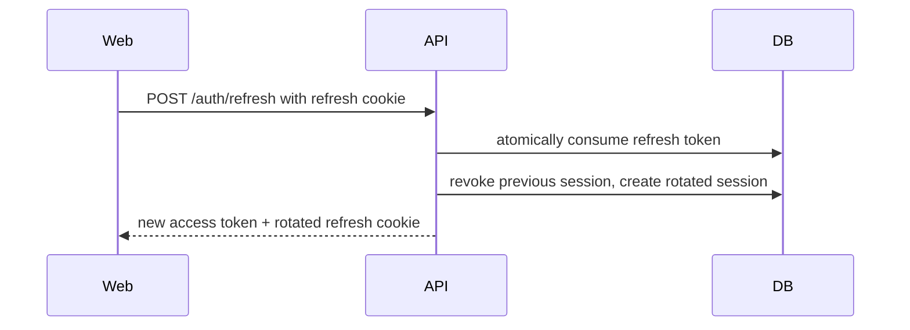
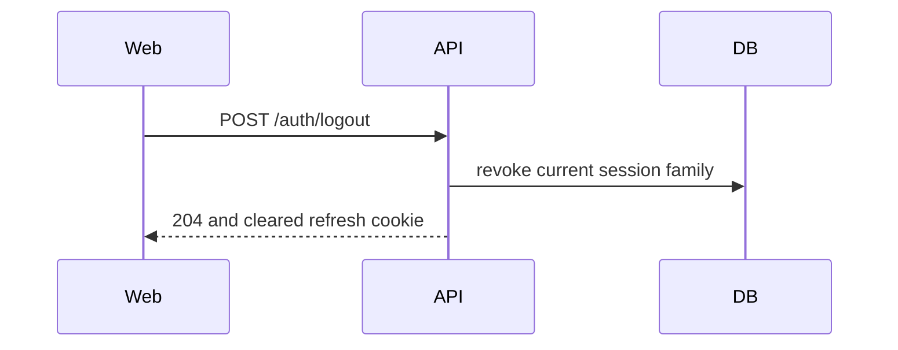

IDENTITY · AUTH

This page is the canonical reference for backend auth behavior. Endpoint shapes
are summarized in [API endpoints](/backend/api-endpoints), and generated schema
details live in [Backend contracts](/backend/contracts).

## Register

Creates a user, credentials row, and empty preferences row. Registration does
not return tokens; the frontend logs in immediately after successful creation.

| Concern | Behavior |
| --- | --- |
| Endpoint | `POST /auth/register` |
| Validation | Email must be valid; password must satisfy the backend minimum. |
| Security | Password is hashed with Argon2 before persistence. |
| Errors | `409` for duplicate email, `422` for invalid input, `429` for rate limit. |
| Related | [Spec 002](/sdd/specs/002-backend-auth-slice), [Authentication](/glossary/authentication), [Migration](/glossary/migration) |

```mermaid
sequenceDiagram
  participant Web
  participant API
  participant DB
  Web->>API: POST /auth/register
  API->>DB: insert user, credentials, empty preferences
  API-->>Web: 201 user profile
  Web->>API: POST /auth/login
  API-->>Web: access token + refresh cookie
```

## Login

Authenticates email/password and creates a session plus refresh-token
fingerprint. The access token is returned in JSON; the refresh token is sent as
an HttpOnly cookie.

| Concern | Behavior |
| --- | --- |
| Endpoint | `POST /auth/login` |
| Validation | Normalized email plus password payload. |
| Security | Unknown email and wrong password return the same generic `401`. |
| Errors | `401` for invalid credentials, `422` for invalid input, `429` for rate limit. |
| Related | [API endpoints](/backend/api-endpoints), [Authorization](/glossary/authorization) |

## Refresh

Rotates the refresh token and access token. Refresh tokens are single-use; reuse
revokes the session family.

| Concern | Behavior |
| --- | --- |
| Endpoint | `POST /auth/refresh` |
| Validation | Requires the refresh cookie and bearer-token guard. |
| Security | Previous refresh token is consumed atomically. Reuse returns `401`. |
| Errors | `401` for missing, invalid, revoked, or reused refresh token. |
| Related | [Backend contracts](/backend/contracts), [OpenAPI](/glossary/openapi) |

## Logout

Revokes the current session family and clears the refresh cookie. The endpoint
is idempotent so repeated logout calls do not create client-visible failures.

| Concern | Behavior |
| --- | --- |
| Endpoint | `POST /auth/logout` |
| Validation | Uses the current bearer session if present. |
| Security | Revokes server-side session and refresh-token state. |
| Errors | Returns `204` even when there is no active session to revoke. |
| Related | [Identity backend overview](/backend/overview), [Testing strategy](/development/testing-strategy) |

