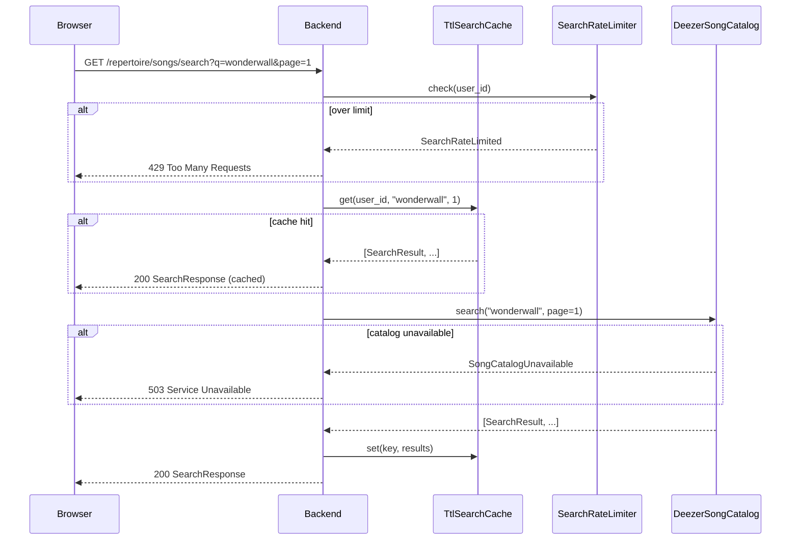

## Overview

The `repertoire` bounded context lets authenticated users build and maintain a personal list of songs they know how to play, each annotated with an instrument and a proficiency level.

### User stories covered

| Story | Summary |
|-------|---------|
| US1 | Add a song to my repertoire (search Deezer catalog → configure instrument + proficiency → save) |
| US2 | View my repertoire (list ordered by `created_at DESC`) |
| US3 | Remove a song from my repertoire (hard delete) |
| US4 | Update proficiency on an existing entry (inline) |

---

## Architecture

The context follows the same hexagonal / clean-architecture pattern as `identity`:

```
domain/          ← pure Python; no FastAPI, no SQLAlchemy, no httpx
  entities.py        RepertoireEntry, SearchResult
  value_objects.py   RepertoireEntryId, SongExternalId, Instrument, ProficiencyLevel
  ports.py           RepertoireEntryRepository, SongCatalogPort, SearchCachePort, SearchRateLimiter
  errors.py          RepertoireError hierarchy

application/
  use_cases/         SearchSongs, AddOrUpdateEntry, ListMyEntries, RemoveEntry, UpdateProficiency

adapters/
  persistence/       SqlAlchemyRepertoireEntryRepository (shares identity's Base)
  catalog/           DeezerSongCatalog, FakeSongCatalog (test double)
  caching/           TtlSearchCache (OrderedDict LRU + per-entry TTL)
  rate_limiting/     InMemorySearchLimiter (rolling window per user_id)
  http/              FastAPI router, Pydantic schemas, dependency providers, error mapping
```

### Design invariants (never violate)

- Domain and application layers are free of `fastapi`, `sqlalchemy`, `httpx` — enforced by the architecture-guard test and ruff banned-modules rules.
- No songs aggregate: song metadata is **denormalized at add-time** into `repertoire_entries` — no separate songs table (ADR-0008).
- Every Deezer call is server-side, proxied through `SongCatalogPort` — no browser-direct catalog hits (ADR-0009).

---

## Search flow



---

## Error catalog

| Domain error | HTTP status | When |
|---|---|---|
| `InstrumentUnknown` | 422 | Instrument not in the 12-value catalog |
| `ProficiencyUnknown` | 422 | Proficiency not one of `learning / practicing / ready` |
| `SearchQueryTooShort` | 422 | Query shorter than 2 characters |
| `EntryNotFound` | 404 | Entry missing **or** owned by a different user (existence not leaked) |
| `DuplicateEntry` | — | Handled in-band: `POST /entries` returns 200 + `X-Repertoire-Action: updated` |
| `SongCatalogUnavailable` | 503 | Deezer unreachable or 5xx |
| `SongCatalogRateLimited` | 429 | Deezer returns 429 |
| `SearchRateLimited` | 429 | Per-user rolling-window limit hit |

---

## Environment variables

These five vars are added by Spec 003. All have safe defaults for local development.

| Variable | Default | Purpose |
|---|---|---|
| `DEEZER_BASE_URL` | `https://api.deezer.com` | Base URL for the Deezer search API |
| `SEARCH_CACHE_TTL_SECONDS` | `60` | How long a cached search result lives |
| `SEARCH_CACHE_MAX_ENTRIES` | `1024` | LRU capacity of the in-process cache |
| `SEARCH_RATE_LIMIT_PER_WINDOW` | `30` | Max search requests per user per window |
| `SEARCH_RATE_LIMIT_WINDOW_SECONDS` | `60` | Rolling-window duration for the rate limiter |

---

## API contract

The committed OpenAPI snapshot lives at
[`specs/003-repertoire-song-entry/contracts/openapi.json`](https://github.com/ThiagoPanini/campfire/blob/main/specs/003-repertoire-song-entry/contracts/openapi.json).

The contract test at `apps/api/tests/contract/test_repertoire_openapi_snapshot.py` asserts that every
path, operation, and schema in that snapshot is present in the live `create_app().openapi()` output.

### Endpoints summary

| Method | Path | Auth | Description |
|--------|------|------|-------------|
| `GET` | `/repertoire/songs/search` | Bearer | Search the Deezer catalog |
| `POST` | `/repertoire/entries` | Bearer | Add or update a repertoire entry |
| `GET` | `/repertoire/entries` | Bearer | List the caller's entries |
| `PATCH` | `/repertoire/entries/{entry_id}` | Bearer | Update proficiency on an entry |
| `DELETE` | `/repertoire/entries/{entry_id}` | Bearer | Hard-delete an entry |

---

## Database

Migration `0003_repertoire_initial` adds:

```sql
CREATE TABLE repertoire_entries (
    id            UUID PRIMARY KEY,
    user_id       UUID NOT NULL REFERENCES users(id) ON DELETE CASCADE,
    song_external_id   TEXT NOT NULL,
    song_title         TEXT NOT NULL,
    song_artist        TEXT NOT NULL,
    song_album_title   TEXT,
    song_release_year  INT CHECK (song_release_year BETWEEN 1900 AND 2100),
    song_cover_url     TEXT,
    instrument    TEXT NOT NULL CHECK (char_length(instrument) BETWEEN 1 AND 64),
    proficiency   TEXT NOT NULL CHECK (proficiency IN ('learning', 'practicing', 'ready')),
    created_at    TIMESTAMPTZ NOT NULL DEFAULT now(),
    updated_at    TIMESTAMPTZ NOT NULL DEFAULT now()
);

-- Duplicate-prevention unique index
CREATE UNIQUE INDEX ux_repertoire_entries_user_song_instrument
    ON repertoire_entries (user_id, song_external_id, instrument);

-- List-by-user performance index
CREATE INDEX ix_repertoire_entries_user_recent
    ON repertoire_entries (user_id, created_at DESC);
```
