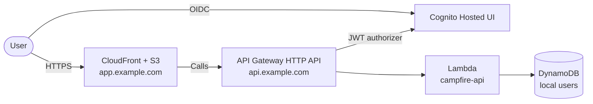

Campfire is a small monorepo split along clear boundaries: a static frontend, a Lambda-based backend, and AWS infrastructure described as code. Identity is treated as a platform capability, not as application logic.

## High-level shape

- **Frontend** is a Vite + React single-page app served as static assets behind CloudFront.
- **Backend** is one Python Lambda that handles `GET /health` and `GET /me`, fronted by API Gateway HTTP API with a JWT authorizer backed by Cognito.
- **Persistence** is one DynamoDB table for the minimum local user record.
- **Identity** is Cognito Hosted UI. The application only consumes verified claims; it does not manage passwords or user state itself.

## Backend layering

The backend follows clean architecture and DDD conventions adapted to a small Lambda. Code is split into:

- `domain/` — entities and repository interfaces (`LocalUser`, `LocalUserRepository`)
- `application/` — use cases and DTOs (`user_context` service)
- `infrastructure/` — adapters: HTTP handlers, DynamoDB persistence, claims mapping
- `main/` — composition, settings, logging, and the Lambda entry point

Local-only modules under `main/` provide a thin HTTP server, JWT signer, and local AWS bootstrap. The root Makefile starts LocalStack, seeds required resources, and then runs the same handler locally without diverging code paths.

## Frontend layering

The frontend is organized by route concern and feature:

- `routes/public/` — landing page and OIDC auth callback
- `routes/protected/` — authenticated shell, protected route guard, and `/me` bootstrap page
- `features/auth/` — session handling, sign-in/sign-out actions, and OIDC config
- `features/me/` — `useMe` hook that calls the backend
- `lib/` — HTTP client, environment access, generated API types

## Infrastructure

Terraform modules under `infra/terraform` define every AWS resource needed for the first deployable environment: DNS and ACM, CloudFront and S3, Cognito user pool and client, API Gateway and Lambda, DynamoDB, IAM, and CloudWatch log groups. The minimum environment is reprovisionable from versioned definitions; long-lived resources are not created manually.

## Observability boundaries

The system distinguishes failures across the stack so that operators can quickly localize problems:

| Symptom | Likely layer |
|---------|--------------|
| Domain unreachable, TLS warnings | DNS, ACM, CloudFront |
| Sign-in cannot start | Cognito client config, frontend env |
| `/me` returns 401 with valid login | API Gateway JWT authorizer, Cognito audience |
| `/me` returns 5xx | Lambda logs, DynamoDB access |
| First login creates duplicate users | Conditional write logic in the persistence adapter |
