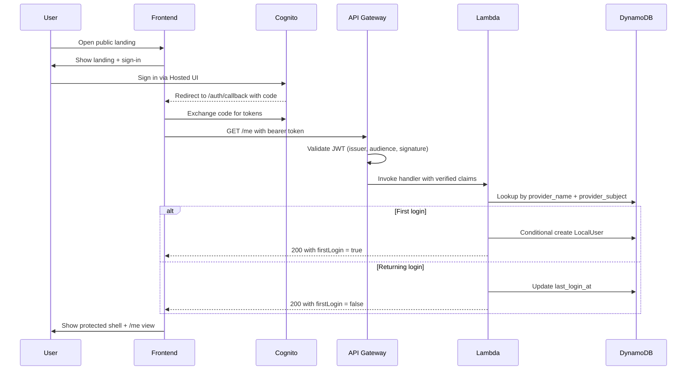

Campfire uses **Cognito email/password** and **Google OAuth** for self-service authentication. There is no admin-only or pre-provisioned user path in the MVP — every user signs up and is verified through Cognito.

## What this slice delivers

- A public landing page reachable on the Campfire domain over TLS.
- Self-service Cognito email/password sign-up with mandatory email verification.
- Google OAuth redirect sign-in with automatic identity linking to existing email accounts.
- Password recovery via Cognito's built-in forgot-password flow.
- Protected routes that block unauthenticated visitors and redirect to sign-in with `returnTo`.
- A backend `/me` endpoint that validates the Cognito bearer token and returns the full Campfire user context, including auth summary, onboarding state, and first-login flag.
- Automatic creation of a Campfire local user record on the first successful login, with identity linking and idempotent reuse on every subsequent login.
- Single Campfire account per normalized verified email regardless of auth provider.

## What this slice intentionally excludes

- Public self-service sign-up. The first environment only accepts pre-provisioned Cognito users created by an administrator.
- Roles, permissions, and group membership.
- Profile editing, avatars, notification settings.
- Music-domain features such as jam sessions, songs, instruments, or recommendations.

## Identity is platform, not business logic

Cognito issues identity. API Gateway validates JWTs at the boundary. The application code only sees verified claims and persists Campfire-owned data. That separation is the load-bearing constraint of this slice.

<Info>
A user can only enter Campfire and bootstrap a local record when their identity provider asserts a verified email. Unverified identities are rejected before any persistence happens.
</Info>

## End-to-end flow

## Entities

<Tabs>
  <Tab title="LocalUser">
    The minimum Campfire-owned record created on first login.

    | Field | Notes |
    |-------|-------|
    | `user_id` | Internal Campfire identifier, immutable |
    | `provider_name` | External identity provider identifier |
    | `provider_subject` | Stable external subject claim |
    | `email` | Current email claim |
    | `email_verified` | Whether the IdP considers the email verified |
    | `display_name` | Best available human-readable name |
    | `status` | Defaults to `active` for this slice |
    | `created_at` / `updated_at` / `last_login_at` | Lifecycle timestamps |

    The pair `(provider_name, provider_subject)` uniquely identifies one `LocalUser`. Conditional writes prevent duplicate creation under concurrent first-logins.
  </Tab>
  <Tab title="VerifiedIdentityClaims">
    Normalized claims handed to the application after API Gateway accepts the JWT.

    | Field | Source |
    |-------|--------|
    | `provider_name` | Issuer |
    | `provider_subject` | `sub` |
    | `email` | `email` |
    | `email_verified` | `email_verified` |
    | `display_name` | `name` or `cognito:username` |

    Claims are only constructed when token validation has already succeeded. The application layer never validates tokens itself.
  </Tab>
  <Tab title="BootstrapIdentityView">
    The `/me` response returned to the authenticated shell.

    | Field | Notes |
    |-------|-------|
    | `user.id` | The Campfire `user_id` |
    | `user.email` | Email claim, when present |
    | `user.displayName` | Display name |
    | `user.status` | `active` for this slice |
    | `user.lastLoginAt` | Updated on every successful call |
    | `bootstrap.firstLogin` | `true` only when this request created the record |

    The view never includes raw tokens, secrets, or infrastructure details.
  </Tab>
</Tabs>

## The `GetOrBootstrapLocalUser` use case

1. Look up an existing `LocalUser` by `(provider_name, provider_subject)`.
2. If found, update `last_login_at` and return the view with `firstLogin = false`.
3. If not found, conditionally create the record with baseline timestamps and return the view with `firstLogin = true`.

Failure modes the use case must surface distinctly:

- Missing required verified claims (`email_verified` not true, missing `sub`)
- Persistence conflict during bootstrap
- Persistence unavailable

## Acceptance signals

The slice is considered working end to end when all of these hold:

<Steps>
  <Step title="Public access">
    The Campfire domain serves the landing page over TLS, and protected routes redirect unauthenticated visitors into auth.
  </Step>
  <Step title="Authenticated entry">
    A pre-provisioned user with a verified email signs in through Cognito and reaches the protected shell.
  </Step>
  <Step title="Bootstrap on first login">
    The first authenticated `GET /me` creates a `LocalUser` and returns `firstLogin: true`.
  </Step>
  <Step title="Idempotent reuse">
    Subsequent `GET /me` calls reuse the same `LocalUser` and return `firstLogin: false`.
  </Step>
  <Step title="Sign-out">
    Sign-out clears protected access; protected routes are blocked again until the next sign-in.
  </Step>
</Steps>

## Operational triage

| Symptom | Where to look |
|---------|---------------|
| Site unreachable | CloudFront distribution status, S3 deployment, DNS, ACM validation |
| Sign-in cannot start | Cognito app client callback and logout URLs; frontend env |
| Sign-in succeeds but `/me` returns 401 | API Gateway JWT authorizer, audience and issuer config |
| `/me` returns 5xx | Lambda logs, DynamoDB IAM permissions and table access |
| First login creates duplicates | Conditional write on `(provider_name, provider_subject)` in the persistence adapter |
| Hosted UI works but the shell still fails | Frontend uses the latest Cognito client id, callback URL, and logout URL outputs |

## Related references

<Columns cols={2}>
  <Card title="API reference" icon="code" href="/api-reference/introduction">
    The `/health` and `/me` endpoints, generated from the OpenAPI contract.
  </Card>
  <Card title="Local environment" icon="terminal" href="/guides/platform/local-environment">
    Run the same backend code locally with LocalStack and a local JWT signer.
  </Card>
</Columns>
