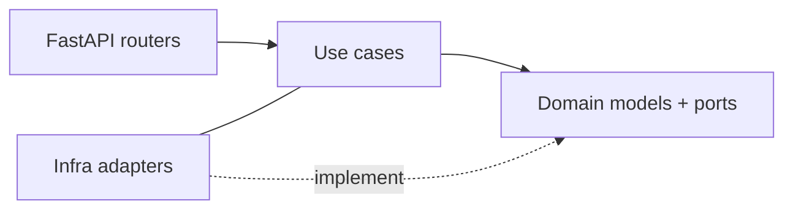

Campfire follows Hexagonal / Clean Architecture. Dependencies point inward:

```
interfaces/  →  application/  →  domain/
         ↖   infrastructure/  ↗
```

## Layer rules

<CardGroup cols={2}>
  <Card title="domain/" icon="cube">
    Pure business model. Stdlib only — dataclasses, datetime, uuid,
    collections, typing. No FastAPI, no pydantic, no third-party code.
  </Card>
  <Card title="application/" icon="gears">
    Use cases. Imports domain + own DTOs. No FastAPI, no repositories
    imported directly — only Protocols from `domain/`.
  </Card>
  <Card title="interfaces/" icon="plug">
    FastAPI routers. Call **use cases only** — never reach
    `container.<repo>` directly. New endpoint = new use case first.
  </Card>
  <Card title="infrastructure/" icon="warehouse">
    Adapters + composition root. In-memory repositories, placeholder auth,
    `bootstrap.py`. The only layer allowed to know about concrete technologies.
  </Card>
</CardGroup>

## Ports are Protocols

Repositories and providers use `typing.Protocol` (structural typing), not
abstract base classes. This keeps adapters duck-typed and domain code free of
inheritance trees.

## Extension seams

| Task | Where |
|---|---|
| New domain concept | `domain/models/` + `Protocol` in `domain/repositories/` |
| New behavior | `application/use_cases/` — depends only on domain |
| New endpoint | `interfaces/api/v1/` → use case (never a repo) |
| Swap persistence | new adapter next to `infrastructure/persistence/memory/`; flip `bootstrap.py` |
| Swap song search | new `SongSearchProvider` adapter; flip `bootstrap.py` |
| Swap auth | replace `PlaceholderAuthenticator` in `infrastructure/auth/` |

## The composition root

`infrastructure/bootstrap.py` is the only place that wires concrete adapters.
Swapping implementations is a one-file change. The `Container` dataclass is
attached to `app.state.container` inside the FastAPI lifespan and pulled via
`Depends`.

## Invariants worth remembering

- `RepertoireEntry` unique per `(user_id, song_id, instrument)`.
- `Instrument` normalized lowercase via `object.__setattr__` in
  `__post_init__` (frozen dataclass trick).
- `Proficiency` is `0..10`; category label is a `@property`.
- `Song` identified by `(title, artist)`; find-or-create inside
  `RegisterRepertoireEntry`.

## Diagram



Arrows point in the direction of compile-time dependency. Adapters
**implement** domain ports; they do not drive the use cases.
